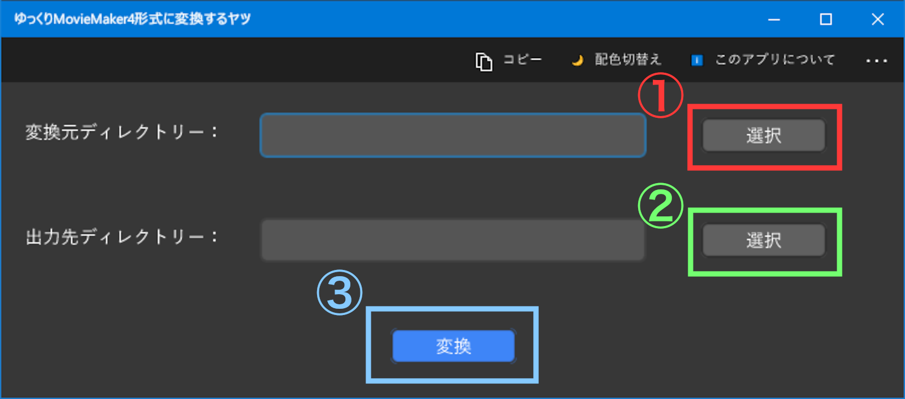
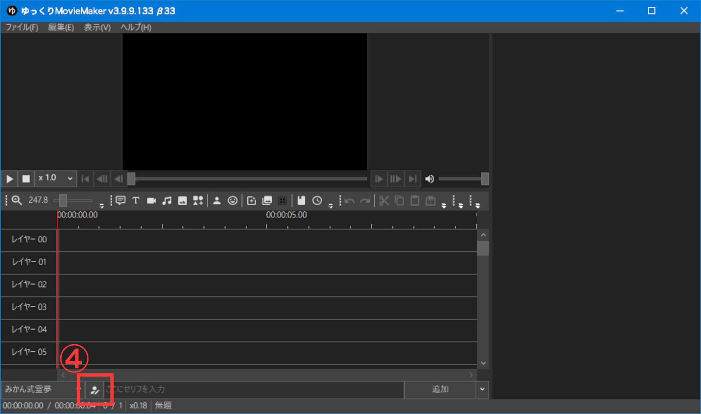
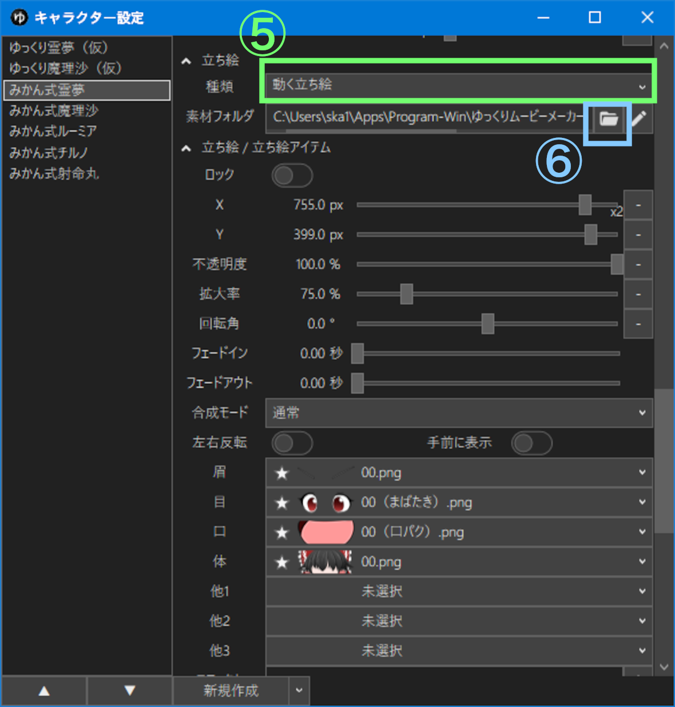

# キャラ素材をnicotalk形式からゆっくりMovieMaker4形式に変換するヤツ ／ YukkuriCharacterNicotalkToYMM4

<!-- convert nicotalk’s yukkuri character material to Yukkuri Movie Maker 4’s character -->

nicotalkのキャラ素材スクリプト対応のゆっくりキャラ素材を，ゆっくりMovieMaker4の動く立ち絵素材の形式に変換して，ゆっくりMovieMaker4でも**ある程度**まばたきや口パクを使えるようにする程度の~~能力~~ アプリです。

主要機能の実装は終わりましたが，未完成です。👈ココ重要

## 概要

↑のとおりです。*n*番煎じだったらスミマセン。

ゆっくりMovieMaker4が便利そうだったのですが，広く流通しているキャラ素材スクリプト対応のゆっくりキャラ素材が対応しておらず不便だったので，変換するヤツ作りました。

変換とはいえ，画像自体は一切加工せず，ディレクトリー構造やファイル名をゆっくりMovieMaker4にとって適切になるように変えるだけです。

nicotalkの「キャラ素材スクリプト」（ゆっくりMovieMaker3でも使われていたもの）とゆっくりMovieMaker4の「動く立ち絵」は全く異なる処理系（実装）のようです。キャラ素材の変換のみで同じ見た目・動きを再現することはできませんので，ご注意ください（特に改変禁止の素材にお気をつけください）。

キャラ素材スクリプトVer5a以降対応のキャラ素材は，構成が大きく異なるため変換できません。

## 注意事項（主にライセンス関係）

- 本アプリを利用したことによるライセンス関係の問題について，開発者は一切責任を負いません。**利用者様が必ず**以下の利用規約を確認してからご使用ください。
	1. nicotalk[キャラ素材スクリプト利用規約](http://www.nicotalk.com/kiyaku.html) の「① キャラ素材を動画使用する場合」  
	※ ゆっくりMovieMaker4でキャラ素材スクリプトは使われていないようですが，キャラ素材スクリプト用に作られたキャラ素材を入力するため，ご一読ください。
	1. 変換元のキャラ素材の利用規約
- 後者のキャラ素材の利用規約にて，改変が禁止されている場合，本アプリの利用はグレーゾーンなので（画像自体は変えませんが，ゆっくりMovieMaker4で同じ見た目・動きを再現できません），使用をやめるか，キャラ素材作成者様へ問い合わせることをオススメします。
- 改変素材の配布が許可されている場合を除いて，本アプリで変換したキャラ素材の配布（インターネット上で公開，クラウドストレージ・USBメモリー等で友人に渡す，など）は**しないで**ください。
- 規約面以外（本アプリを利用したことによるPCの不具合等）に関しても開発者は一切責任を負いませんので，**自己責任**でご利用ください。
	- とはいえ，あからさまなバグが残ったまま配布したり，mainブランチへ統合したりすることはありません。
- 本アプリのソースコードはGPL v3のもと公開しています。

## 動作環境

- **OS**：Windows 10 1903以降
- **その他**：ゆっくりMovieMaker4が動く環境であれば動くと思います。

## ダウンロード方法

（未完成のため不明。Microsoft Storeでの公開を考えています）

## 使い方

1. 変換元ディレクトリー（「目」「口」「体」等のひとつ上の階層の，キャラクター名のフォルダー）を選択します。
1. 出力先ディレクトリー（書き出したい場所）を選択します。
1. 「変換」を押します。終わると「変換完了しました」と表示されます。
1. ゆっくりMovieMaker4で「キャラクターの編集」を開きます。
1. 「立ち絵」の「種類」を「動く立ち絵」にします。
1. 「素材フォルダ」を出力先ディレクトリーの中のキャラクター名のフォルダーにします。

## 動作確認済みの素材

次にあげるのはこのアプリでの変換後ゆっくりMovieMaker4にて，3キャラ以上で基本的なまばたきと口パクに対応し，なおかつ少なくとも**個人利用の範囲で**改変が許可されているゆっくりキャラ素材です（2021/03/07時点）。

- みかん式ゆっくりキャラ素材：[https://www.oxmikanxo.com/](https://www.oxmikanxo.com/)

## 仕様参考

これらの情報をもとに [このアプリの仕様](./仕様.md)を決めました。素晴らしいツールを作ってくださったズーズ様，饅頭遣い様を始め，キャラ素材を作っている方，Web上に情報を残してくれた方など大変参考になりました。感謝いたします。

- ズーズ様「キャラ素材を自作したい方向け」，キャラ素材の作り方：[ar296896](https://ch.nicovideo.jp/charasozai/blomaga/ar296896)
- ズーズ様「【素材制作者向け】キャラ素材スクリプトVer5a対応のヒント」，キャラ素材の作り方：[ar302099](https://ch.nicovideo.jp/charasozai/blomaga/ar302099)
- ズーズ様「キャラ素材スクリプト更新履歴」，nicotalk＆キャラ素材配布所：[http://www.nicotalk.com/charasozai.html](http://www.nicotalk.com/charasozai.html)
- 饅頭遣い様「動く立ち絵素材の作り方」，饅頭遣いのおもちゃ箱：[https://manjubox.net/ymm4/faq/立ち絵機能/動く立ち絵素材の作り方/](https://manjubox.net/ymm4/faq/立ち絵機能/動く立ち絵素材の作り方/)
- きつね様「じさくみち４（アニメーションさせる方法、素材作成「体・髪」）」，素材や絵の話とか垂れ流し：[ar85187](https://ch.nicovideo.jp/kitsunerider/blomaga/ar85187)
- 試製橙100%果汁様「素人が実況動画を作るまで【第５回】キャラ素材を作ってみた！ひとり暮らしの動画事情」，橙色のひとり暮らし：[https://daidaiiro.net/aviutl-ymm-005/](https://daidaiiro.net/aviutl-ymm-005/)

## 今後の予定

- 残りの実装
	- 次を「他」へ統合
		- 全
		- 髪
- アイコンの制作
- Microsoft Storeでの公開
- 紹介動画の制作

## リンク集

nicotalk＆ゆっくりMovieMaker

- nicotalk＆キャラ素材配布所：[http://www.nicotalk.com/charasozai.html](http://www.nicotalk.com/charasozai.html)
- ゆっくりMovieMaker4：[https://manjubox.net/ymm4/](https://manjubox.net/ymm4/)

開発者のリンク

- Twitter：[@SK_Animation](https://twitter.com/SK_Animation)
- ブロマガ：[ar1739328](https://ch.nicovideo.jp/skas-web/blomaga/ar1739328)
- ニコニコ：[user/28511019](https://www.nicovideo.jp/user/28511019)
- YouTube：[c/0150159SK](https://youtube.com/c/0150159SK)
- このアプリの紹介：（未作成）

## 更新履歴

YYYY/MM/DD（年年年年/月月/日日）

- 2021/03/07　Ver.0.0.0　主要機能の実装完了
